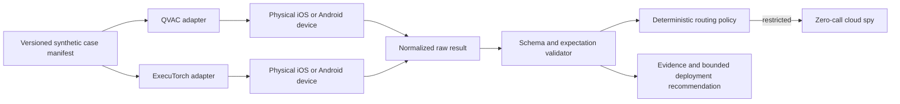

# System Design: Cross-Device Local AI Deployment Reliability Lab

Plan ID: `local-ai-deployment-lab`  
Risk tier: 2  
Lifecycle target before implementation: `VALIDATED`

## Problem and desired outcome

The archived QVAC experiment proves that a local model can run quickly on one physical iPhone, but it does not establish a transferable deployment method. The model failed a trivial exact-output instruction, recommended an unsafe cloud or hybrid route for restricted data, and was tested through a recipient-specific application with a toy policy check. The desired outcome is a small runtime-neutral lab that determines what one privacy-sensitive workflow can reliably do across real consumer devices, preserves failures, and produces bounded deployment recommendations rather than a universal winner.

## Users, stakeholders, and operators

Tim owns the repository, physical devices, scope, publication decision, and career use. The primary reader is an AI implementation, solutions engineering, deployment strategy, technical product, developer experience, or local-first AI hiring manager. Runtime maintainers may receive a later reproduction or documentation contribution, but no external communication occurs under this plan without separate approval.

## Current system

`qvac-implementation-lab` is a private folder inside the Personal workspace. It pins QVAC 0.14.1, contains a React Native/Expo iOS application, three mobile prompts, Mac RAG scripts, raw results, generated worker bundles, absolute local paths, Expo build logs, and Tether-specific documentation. Its iPhone evidence identifies an iPhone 15 Pro on iOS 26.2.1. Current Apple tooling also identifies an iPhone 15 on iOS 26.5. The user-recalled iPhone 14 inventory is not corroborated. An Android device is reported but not identified, and Android platform tools are unavailable.

## Scope and non-goals

Version one evaluates one synthetic incident-intake workflow through QVAC and ExecuTorch adapters. It covers structured-output validity, case-level correctness, deterministic no-cloud routing, offline status, latency, cancellation, and recovery on verified physical devices. It does not build a general benchmark framework, compare every runtime, use real customer data, optimize models, certify readiness, publish externally, or add Apple Foundation Models, MLX, battery, thermal, multimodal, delegated-inference, or fleet testing without a later scope review.

## Requirements

1. A versioned case schema and result schema must remain independent of runtime language.
2. The case corpus must contain eighteen clearly synthetic straightforward, ambiguous, malformed, adversarial, and restricted examples.
3. Every runtime result must identify the model family, artifact format, quantization, prompt template, generation parameters, runtime version, device model, OS, backend when observable, and verification status of network isolation.
4. Restricted inputs must produce zero calls to an injected cloud client regardless of model output.
5. Raw output must be preserved before parsing or analysis.
6. Published claims must distinguish model, runtime, backend, device, and application behavior.
7. A fresh setup must not require private paths, copied signing state, or manual changes to generated code.

## Quality attributes

Reliability and honesty dominate feature breadth. Schema validation must be deterministic. Unknown measurements remain `not_measured`. Result records must be reproducible, attributable, and scrubbed. Version one should complete on each supported device in a bounded session and add no cloud inference cost. A failed device/runtime combination is acceptable evidence when the failure is preserved and classified accurately.

## Constraints and assumptions

Verified constraints: QVAC and ExecuTorch use different deployable artifact formats; physical device capability differs; the current Android device is unverified; the old lab contains private and generated state; public publication is not authorized. Assumptions to test: a common Llama 3.2 1B family is feasible across both required adapters; runtime APIs expose enough timing and cancellation data; the low-end Android is 64-bit and can enter developer mode; physical devices have sufficient free storage for model assets.

## System context and dependencies

External dependencies are public SDK packages, model artifacts, Xcode, future Android platform tools, and Tim's physical devices. Package and model downloads occur only during explicit setup.

## Components and responsibilities

- `contracts`: versioned JSON schemas and TypeScript types for cases, capabilities, and results.
- `runner`: selects cases, assigns run IDs, validates records, and renders non-authoritative summaries.
- `policy`: deterministic route decision plus injected local and cloud client interfaces.
- `adapters/qvac`: translates the contract into supported QVAC operations and records native stats.
- `adapters/executorch`: translates the contract into supported ExecuTorch operations and records native stats.
- `sample-data`: synthetic cases plus expected structured behavior.
- `outputs`: immutable raw records, derived summaries, and claim-to-evidence indexes.
- `docs`: setup, repository decision, limitations, analysis, and later demo material.

## State, control flow, and data flow

The runner reads a frozen case manifest and adapter capability record. An adapter loads its declared model artifact, executes a case, and returns raw output plus observable native metrics. The validator parses the raw output and records schema and expectation results without rewriting evidence. Trusted case classification then enters the deterministic router. A restricted classification can only select local handling or human review; the injected cloud spy records whether any prohibited call was attempted. Derived summaries reference raw run IDs and never replace them.

## Failure modes and degraded behavior

Expected failures include unavailable devices, unsupported architecture or operators, insufficient storage or memory, model-download interruption, load timeout, malformed or nonterminating output, missing runtime metrics, cancellation failure, and inability to recover after cancellation. Each failure becomes a typed result. Unknown completion outcomes are not blindly retried. One bounded retry may be used only for a classified transport or developer-tool connection failure, never to erase a model or runtime failure. A device/runtime pair may be reported `constrained`, `not_supported`, or `not_tested` with evidence.

## Threats, privacy, secrets, and abuse

Model output and synthetic incident text are untrusted. Prompt injection must not alter trusted classification or routing. No real support transcript, wallet, account, health record, customer name, device identifier, signing identity, keychain information, or credential enters fixtures or committed logs. Model and package sources require provenance. Generated bundles, model weights, signing files, `.expo` state, and absolute paths are excluded from source control. Publication and external contributions remain human-approved actions outside model reasoning.

## Observability and audit evidence

Every run records UTC time, run ID, case ID, adapter/runtime version, model artifact metadata, sanitized device model and OS, backend if observable, network-verification status, load classification, timing, tokens, raw output, parse result, case-level checks, route decision, cloud-spy count, cancellation/recovery outcome, and typed errors. Derived claims use a claim-to-evidence table. Negative runs remain in the evidence set. Scrub checks search for local home paths, device IDs, serials, emails, signing labels, and secret-like strings.

## Capacity, performance, and cost

Version one contains eighteen correctness cases, one cold-load observation, five warm performance repetitions, and one cancellation/recovery sequence per supported adapter/device pair. The expected load is small and manual. There is no paid inference. Model downloads consume local bandwidth and several gigabytes of storage; free-space checks precede download. Battery-drain and sustained thermal claims are deferred because they require longer controlled protocols and would expand scope without yet changing the core decision.

## Deployment, migration, compatibility, and rollback

The lab is a standalone local repository. The archived QVAC folder remains unchanged. Migration copies no generated state; reusable fixtures or logic are manually reviewed and rewritten against the new contracts. Runtime adapters land separately. Device apps remain development builds and can be uninstalled. Rollback reverts the relevant small commit or removes the unpushed local repository. There is no production deployment or automatic external publication.

## Testing and verification

Contract tests cover valid and invalid fixtures, result normalization, unknown metrics, raw-output preservation, and schema versions. Policy tests inject hostile model outputs and assert zero cloud calls for every restricted case. Adapter tests use recorded fixtures before physical runs. Physical-device acceptance requires schema-valid raw evidence from QVAC and ExecuTorch or a preserved capability failure. Reproduction, scrub, and claim-to-evidence checks run before a publication review.

## Human authority and approvals

Tim approved planning and execution of the generalized local-AI lab. Tier 2 does not grant public or employer-facing authority. Tim must separately approve the exact public repository, upstream issue or pull request, demo video, case study, outreach, résumé wording, and application use. The model and runner cannot approve those actions.

## Alternatives and architecture decisions

Extending `qvac-implementation-lab` was rejected because its repository boundary, recipient-specific framing, old SDK, generated state, and confounded evidence would create cleanup risk and a misleading history. A generic dashboard was rejected because QVAC, ExecuTorch, Promptfoo, and other tools already provide measurement surfaces. One monolithic cross-platform application was rejected because native runtime integrations use different languages and build systems. Versioned JSON contracts with native adapters preserve a common evidence layer without pretending the runtimes are identical. ExecuTorch was selected before MLX because it spans iOS and Android and therefore tests portability rather than adding another Apple-only score.

## Unresolved questions

1. Which physical devices are actually available? Apple tooling currently says iPhone 15 and iPhone 15 Pro, not the recalled iPhone 14 models.
2. What is the Android model, OS, RAM, chipset, architecture, free storage, and developer-mode state?
3. Which current QVAC and ExecuTorch artifacts provide the closest defensible Llama 3.2 1B comparison?
4. Which timing, memory, backend, battery, and thermal measurements are mechanically available on each platform without private APIs?
5. Does QVAC issue #3225 reproduce on the current SDK, or must the public contribution anchor move to another live issue?

These questions block individual device or upstream claims, not the contract-first implementation.

## Implementation and commit sequence

1. Validate and seal this design plus the reference-implementation source packet.
2. Commit contracts, synthetic cases, deterministic routing, and unit tests.
3. Commit the current QVAC harness adapter and its contract tests; commit physical evidence separately after storage and device gates pass.
4. Commit the ExecuTorch harness adapter and native-generation contract; commit each native platform bridge and physical run separately after it builds cleanly.
5. Run the cross-device matrix, record analysis and rejected claims, and prepare scrubbed demo materials.
6. Ask Tim to review the exact publication package before any external action.

## Exit criteria

The project is complete when two runtime adapters produce reproducible normalized evidence or honest capability failures on verified physical devices; restricted cases mechanically produce zero cloud calls; the analysis distinguishes every material model/runtime/device/application confound; at least one constrained-device result changes a deployment recommendation; setup works without private state; all public claims link to raw evidence; and Tim has reviewed the exact public package.
